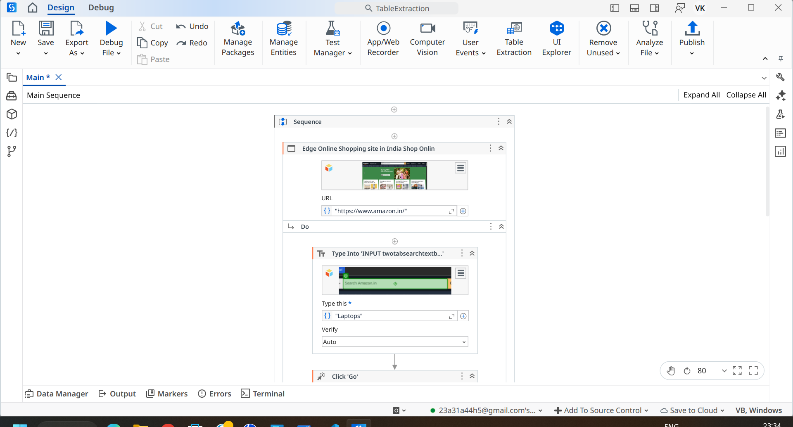
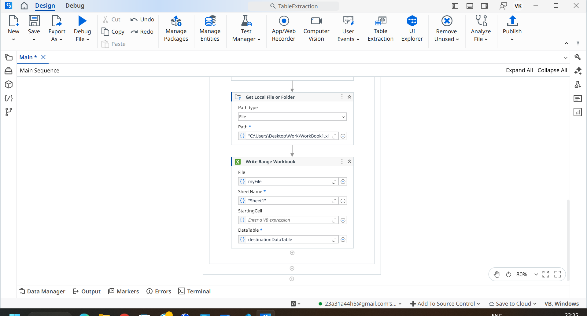
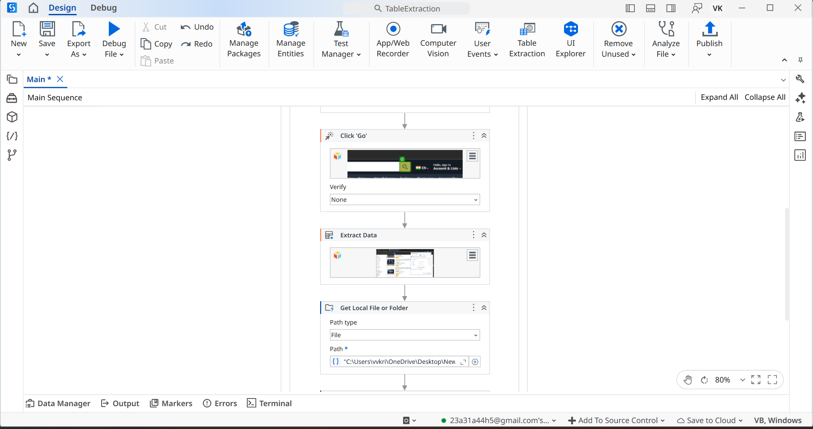

# Automation-Design

**UiPath automation that scrapes laptop product data from Amazon and exports to Excel**

## About

Automation-Design is a UiPath Studio project that automates the extraction of laptop product information from Amazon using table-extraction techniques. The workflow collects product name, price, availability, and customer ratings, and saves the results to an Excel file for analysis and downstream processing. The repository includes example screenshots and an easy-to-open UiPath project so you can run or adapt the automation quickly.

## Project Overview

This is an automation project that automatically collects data about laptops from Amazon using table extraction in UiPath Studio. The automation extracts product information including:
- Product Name
- Price
- Ratings

## Features

- **Automated Data Collection**: Automatically scrapes laptop data from Amazon
- **Table Extraction**: Uses UiPath Studio's table extraction capabilities
- **Data Points**: Collects product name, price, and customer ratings
- **Excel Output**: Generates an Excel file with the extracted data after automation completes

## Technology Stack

- UiPath Studio
- Web Scraping
- Table Extraction

## Screenshots

The repository includes three screenshots (Step1.png, Step2.png, Step3.png) that demonstrate the complete automation workflow.

### Step 1

### Step 2

### Step 3

## Output

After the automation flow runs, the extracted laptop data is saved to an **Excel file** for easy analysis and further processing.

## License

Created by krishna-0212.
